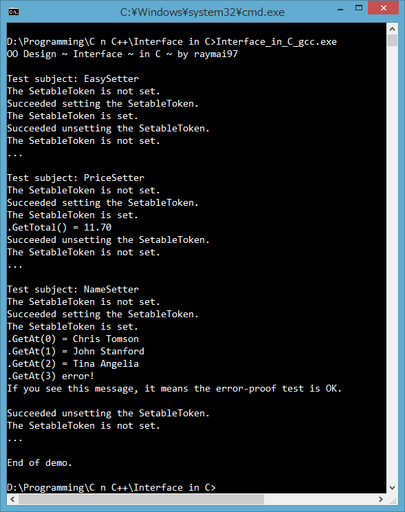

# Interface In C
Example of implementing Interface (part of OO design) in C (C99 standard).



## Interface quick overview

Interface defines what an object can do. How the object works internally is out of the question. It is like 'I don't care what algorithm or method you use, as long as you implement all function declared by me, you're considered one of me'.

```c++
class IRunnable {
public:
	virtual bool IsRunning() = 0;
    virtual void StartRunning() = 0;
    virtual void StopRunning() = 0;
};
class Cat : public IRunnable {...}
class Dog : public IRunnable {...}

void MakeSomethingRun(IRunnable & obj) {
	// I don't care if 'obj' is dog or cat or alien
    obj.StartRunning();
}
```

## Roll your Interface in C

Before I go further, I assume that you already know how to mimic a simple C++ `class` using C struct. If you don't, please find related posts in `stackoverflow.com` as they explain better than me. I also assume that you know C++ can handle stuff like this easily, but still want to know how to do it in C.

First, we need to use `void*` as data type for object instance. This is the only way to get something like `this` in C++. To make the code more readable, let us typedef them:
```c
typedef void *ISetableToken, *EasySetterToken, *NameSetterToken, *PriceSetterToken;
```

Then, declare a `struct` that contains a bunch of function pointers.
```c
typedef struct {
	BOOL(*fnIsSet)(ISetableToken);
    HRESULT(*fnSet)(ISetableToken, int nData, void const *pData); 
    HRESULT(*fnUnset)(ISetableToken);
} ISetable;
```
To declare a `struct` that implements `ISetable`, the declaration starting part must be same:
```c
typedef struct {
	BOOL(*fnIsSet)(ISetableToken);
    HRESULT(*fnSet)(ISetableToken, int nData, void const *pData); 
    HRESULT(*fnUnset)(ISetableToken);
    /* and then other member variables here ... */
```
## Implementing the Interface
Once you've done declaring these, you have to declare and define constructor, destructor and functions declared by `ISetable` for every one of them. It should looks like this:
```c
/* ISetableToken doesn't have ctor/dtor as it is Interface */
EasySetterToken EasySetter_Alloc(); /* ctor */
void EasySetter_Dealloc(EasySetterToken); /* dtor */
NameSetterToken NameSetter_Alloc(); /* ctor */
/* and so on... */
```
```c
/* Functions declared by ISetable */
BOOL EasySetter_IsSet(EasySetterToken);
HRESULT EasySetter_Set(EasySetterToken, int nData, void const *pData);
HRESULT EasySetter_Unset(EasySetterToken);
/* and so on... */
```
In the constructor, you `malloc` for memory with size of `xxxSetter`, initialize its function pointers and member variable, then return the memory you've `malloc`ed in form of `xxxSetterToken`. For destructor, you `free` any member variables as needed, and `free` the `xxxSetterToken` at last.
```c
EasySetterToken EasySetter_Alloc() {
	EasySetter * self = (EasySetter *)malloc(sizeof(EasySetter));
	self->isSet = FALSE;
	self->fnIsSet = EasySetter_IsSet;
	self->fnSet = EasySetter_Set;
	self->fnUnset = EasySetter_Unset;
	return (EasySetterToken)self;
}
void EasySetter_Dealloc(EasySetterToken pSelf) {
	if (EasySetter_IsSet(pSelf)) {
		EasySetter_Unset(pSelf);
	}
	free(pSelf);
}
```
I will leave the definition of `EasySetter_IsSet` and its siblings to you. Run out of idea? Try have a look on my source code.

## C function that accepts Interface

As I mentioned earlier, `interface` defines what an object can do, the implementation detail is none of the caller's business. Now, let us write a function that accepts any `ISetable` object.
```c
void PrintState(ISetableToken pSelf) {
	ISetable *self = (ISetable *)pSelf;
	printf("The SetableToken is %s. \n",
		self->fnIsSet(self) ? "set" : "not set");
}
```
To use it, simply pass anything that implements `ISetable`, like this:
```c
void Test() {
    printf("Testing EasySetter~~ \n");
    EasySetterToken est = EasySetter_Alloc();
    PrintState(est);
    printf("Testing NameSetter~~ \n");
    NameSetterToken nst = NameSetter_Alloc();
    PrintState(nst);
    /* idiot-proof = FALSE */
    int foo = 123;
    PrintState(&foo); /* WRONG but it still compiles */
	/* ... other code ... */
    NameSetter_Dealloc(nst);
    EasySetter_Dealloc(est);
}
```
Note that you have to be careful, if you pass invalid stuff like `int*` or `char*` to `PrintState`, the code will still compile, and when you run the program, it will crash or worse, UB. Why the compiler doesn't stop you is because `ISetableToken` is just a `void*`, and `void*` means 'no data type', you as developer must explicitly know what to do with it.

## Equivalent code in Modern C++

Declaring interface:
```c++
class ISetable {
public:
	virtual BOOL IsSet() = 0;
    virtual HRESULT Set(int nData, void const *pData) = 0;
    virtual HRESULT Unset() = 0;
}
// 'virtual' + '= 0' = pure-virtual functions aka 'must-implement'
```
Declaring classes that implement `ISetable`:
```c++
class EasySetter : public ISetable {
	BOOL m_isSet;
public:
	BOOL IsSet() override;
    HRESULT Set(int nData, void const *pData) override;
    HRESULT Unset() override;
}
// and so on ...
```
Defining them:
```c++
EasySetter::EasySetter() : m_isSet(FALSE) {
}
EasySetter::~EasySetter() {
	if (this->IsSet()) {
    	this->Unset();
    }
}
BOOL EasySetter::IsSet() {
	return this->m_isSet;
}
```
Function that accepts interface:
```c++
void PrintState(ISetable *self) {
    printf("The SetableToken is %s. \n",
        self->IsSet() ? "set" : "not set");
}
```
To use the function:
```c++
void Test() {
	cout << "Testing EasySetter~~" << endl;
	auto es = new EasySetter();
    PrintState(es);
    cout << "Testing NameSetter~~" << endl;
    auto ns = new NameSetter();
    PrintState(ns);
    // idiot-proof = TRUE
    int foo = 123;
    PrintState(&foo); // Error! Compiler will stop us
    // ... other code ...
    delete ns;
    delete es;
}
```
This is why we have C++. Understanding C better certainly will help you to understand C++ better.
I hope this example will be helpful to you.
